# Radio Communications Technical Challenge 2026 — Team Ri-one

**Submission category:** Wi-Fi Technical Challenge (IEEE 802.11ax, 6 GHz / Wi-Fi 6E band)
**Status:** Preliminary submission — 6 GHz bench latency/throughput collected; 5 GHz comparison data included; interference and on-field network-switching tests still pending (see Sections 4–6 and the open items below)

## 1. Goal and Motivation

Our approach focuses on lowering the barrier of entry for new teams by relying on highly accessible, Commercial Off-The-Shelf (COTS) components. Instead of custom-designed PCBs or expensive specialized radio modules, we show that a standard **Intel AX210 (Wi-Fi 6E)** module combined with a modern SBC (**Radxa ROCK 5A**) provides a robust, high-bandwidth, interference-resistant communication link for the RoboCup SSL environment, at a fraction of the cost of bespoke hardware.

## 2. Hardware Architecture

Our robot communication stack is built on the following hardware:

| Component | Choice |
|---|---|
| SBC | Radxa ROCK 5A (RK3588S) |
| Radio Module | Intel AX210NGW (Wi-Fi 6E / 802.11ax) |
| Antenna | Standard M.2 notebook PCB antennas (~2.5 dBi gain) |
| Interface | M.2 E-Key |

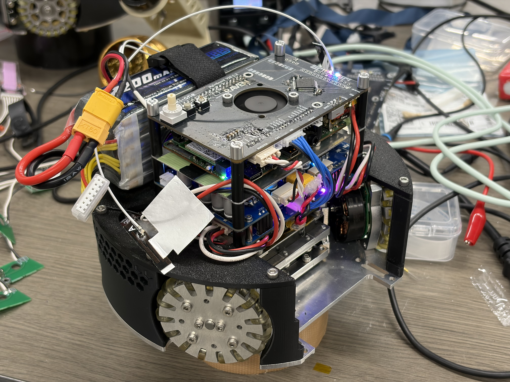
*Figure 1: Assembled robot with the Radxa ROCK 5A + Intel AX210 communication stack integrated into the chassis.*

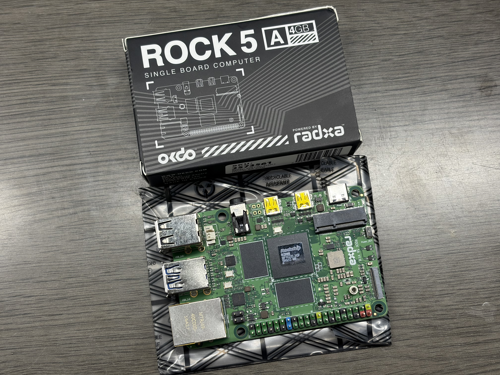
*Figure 2: Radxa ROCK 5A (4GB) single-board computer, shown with retail packaging.*

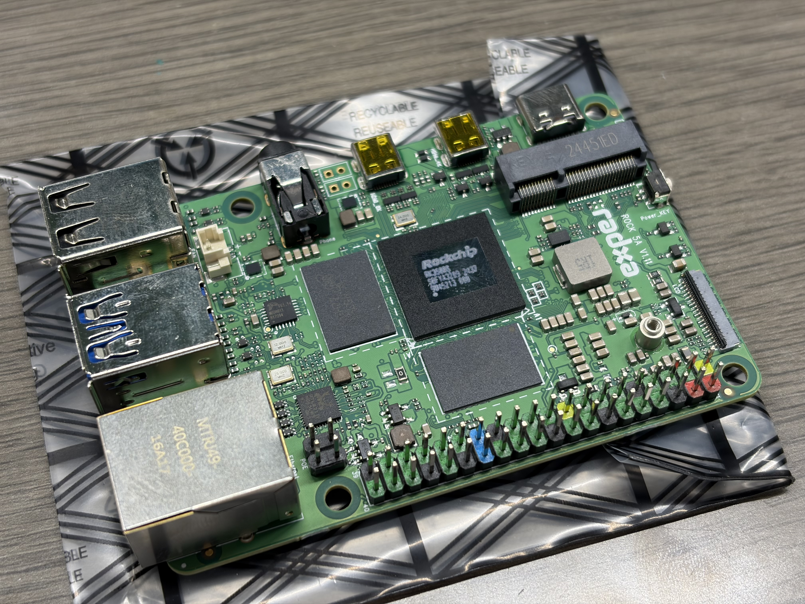
*Figure 3: Radxa ROCK 5A board, close-up of the RK3588S SoC and I/O.*

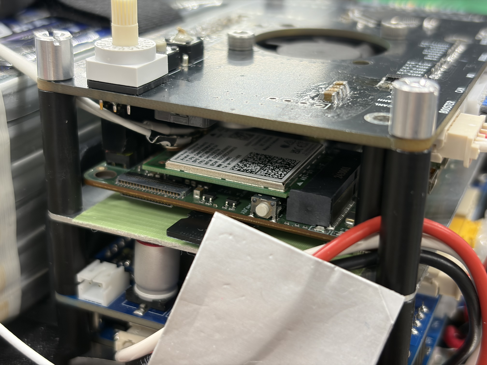
*Figure 4: Intel AX210NGW M.2 card installed on the ROCK 5A.*

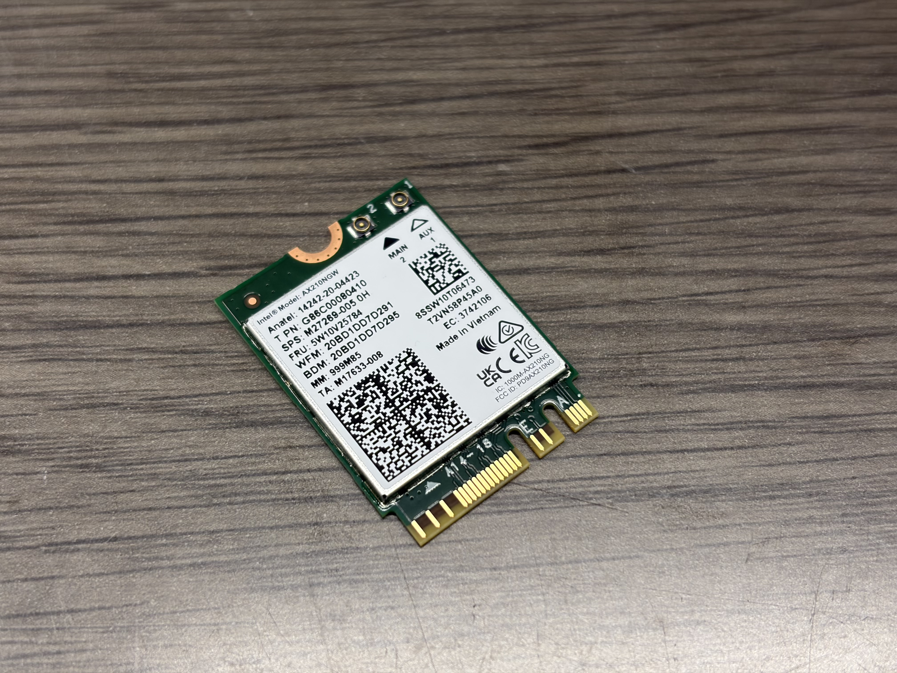
*Figure 5: Intel AX210NGW Wi-Fi 6E module, M.2 (E-Key) form factor.*

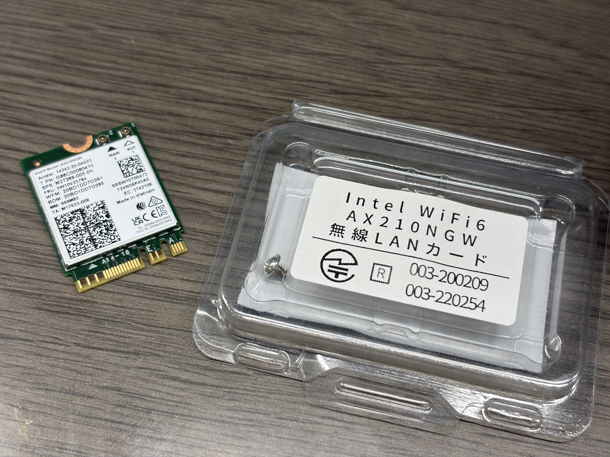
*Figure 6: AX210NGW module and retail packaging, showing Japan TELEC (技適) certification numbers.*

### Why AX210 + ROCK 5A? (The Edge-AI Use Case)

Traditional 2.4 GHz/5 GHz Wi-Fi modules often suffer severe packet loss in crowded competition environments, which typically limits telemetry to simple coordinate data. We instead use the ROCK 5A's built-in NPU (Neural Processing Unit) for on-robot inference, which means we need to stream high-resolution debug images, rich telemetry, and neural-network outputs back to the base station in real time. The AX210's 6 GHz band gives this Edge-AI pipeline the throughput and clean RF environment it needs, at roughly $20 USD per module — a fraction of the cost of custom commercial radio modules.

## 3. Firmware and Environment

To make our results reproducible by any SSL team, we rely entirely on open-source Linux drivers and a containerized environment — no proprietary compilers required.

- OS: Ubuntu 24.04 LTS
- Drivers: standard Linux `iwlwifi`
- Automation: a `docker-compose.yml` that sets up the measurement tools (`iperf3`, `tcpdump`, `iw`) and visualizes the collected data with Python scripts

### Setup Instructions

```bash
git clone https://github.com/Ri-one/<your-repo>.git
cd <your-repo>
docker-compose up --build
```

*(Replace `<your-repo>` with the final repository name before submission.)*

## 4. Summary Data Table

*Bench-test results below. Values reported as Mean / Std. dev. / Max (the official template's "Variance" column is reported here as standard deviation, in the same ms/Mbps units as the mean). Items marked **Pending** still need to be measured — see [Open Items](#8-open-items--still-needed-before-final-submission).*

| Metric | Intel AX210 (Wi-Fi 6E) — **6 GHz** result | 5 GHz comparison |
|---|---|---|
| Round-Trip Latency | Idle (60 FPS, n=7,625): Mean **1.45 ms**, σ 0.37 ms, Max 18.27 ms. Under 20 Mbps UDP: Mean **1.62 ms** (base→robot) / **1.65 ms** (robot→base), Max 2.53 ms (n=98 each) | Idle: 1.56 ms; loaded: 1.92 / 1.67 ms |
| Average Packet Loss | **0.00%** in every 6 GHz run (7,625/7,625 idle ICMP; 0/98 loaded ICMP; 0% UDP at 20 Mbps) | Same (0% at operational rates) |
| Data Rate (base station, received) | TCP: Mean **203.9 Mbps**, σ 21.9 Mbps, 262 retransmits/100 s (eth0 down, WiFi only). UDP 200 Mbps: **188.8 Mbps**, 0.02% loss. UDP 20 Mbps: **20.00 Mbps**, 0.00% loss | TCP: 207 Mbps; UDP 200M: 188 Mbps |
| Detect Interference | **Pending** — HackRF One and `iw survey dump` are part of the toolkit but no spectrum/channel-utilization capture has been logged yet |
| Start Up Time | **7.16 s** (`ifup@wlan0.service`, association + DHCP via `systemd-analyze blame`). From journal timestamps on the same boot: Wi-Fi associated ~4 s after `ifup` start, DHCP lease bound ~7 s after `ifup` start; `network-online.target` reached **9.35 s** after power-on (includes pre-network dependencies) |
| Power Consumption | **12 V** bench supply, robot-side (ROCK 5A + AX210). Idle (link up, no traffic): **0.17 A** (2.0 W). Loaded (TCP max-bandwidth test, ~208 Mbps): **0.26 A** (3.1 W). Single sample per condition — variance not yet characterized |
| Cost | ~$20 USD (AX210NGW module + M.2 antennas) — bill-of-materials estimate, not a bench measurement |
| Firmware Source | Standard Linux kernel `iwlwifi` driver (open source, no custom firmware) |
| eCAD | N/A (COTS components). STL antenna-mount files referenced in the draft are not yet in this repo — need to be added |

## 5. Experimental Methodology

Detailed procedures (commands, `systemd-analyze` output, iperf flags, post-processing scripts, and limitations) are documented in **[MEASUREMENT.md](MEASUREMENT.md)**.

**Topology:** Radxa ROCK 5A + Intel AX210 as the robot-side client, a macOS base station (`172.15.0.44`, wired) as the server/receiver, on a private bench subnet. **6 GHz** traffic uses robot wlan0 `172.15.0.49` (`SSL_Rione_6G`, 5975 MHz). Earlier **5 GHz** runs used `172.15.0.22` (`SSL_Rione`, 5180 MHz). SSH/management: `172.15.0.47` (eth0).

- **Latency baseline:** ICMP `ping` at **60 FPS** (`-i 0.016` s), base station → robot, **7,625 probes** (~122 s at full rate).
- **Latency under load:** the same `ping` test (98 probes, both directions) run concurrently with a 20 Mbps UDP `iperf3` stream, to characterize latency under the kind of sustained telemetry load the Edge-AI use case requires.
- **Throughput / data rate:** `iperf3 3.18`, robot (client) → base station (server), 100 s per run:
  - TCP, unconstrained, to find maximum achievable bandwidth
  - UDP, 200 Mbps target, to find maximum achievable bandwidth without TCP's congestion control
  - UDP, 20 Mbps target, to model the actual NPU debug-data stream profile
- **Start-up time:** on the ROCK 5A, read `systemd-analyze blame` and `systemd-analyze critical-chain network-online.target` to isolate Wi-Fi bring-up; `ifup@wlan0.service` duration is reported as association + DHCP time. Cross-checked against `journalctl -b -u ifup@wlan0.service` for `wpa_supplicant` association and `dhclient` lease timestamps.
- **Power consumption:** measured at the robot's **12 V** input with a bench ammeter — one reading at idle (interface up, no `iperf`/ping traffic) and one during the TCP max-bandwidth run (~208 Mbps received at the base station).
- **Interference monitoring (not yet run):** planned approach is background logging of RSSI and channel busy time via `iw dev wlan0 survey dump`, plus a spectrum sweep using a HackRF One fitted with the UNIT-C6L's antenna to visualize channel congestion, correlated against packet loss.

## 6. Results and Analysis

### A. Latency and Packet Loss (6 GHz)

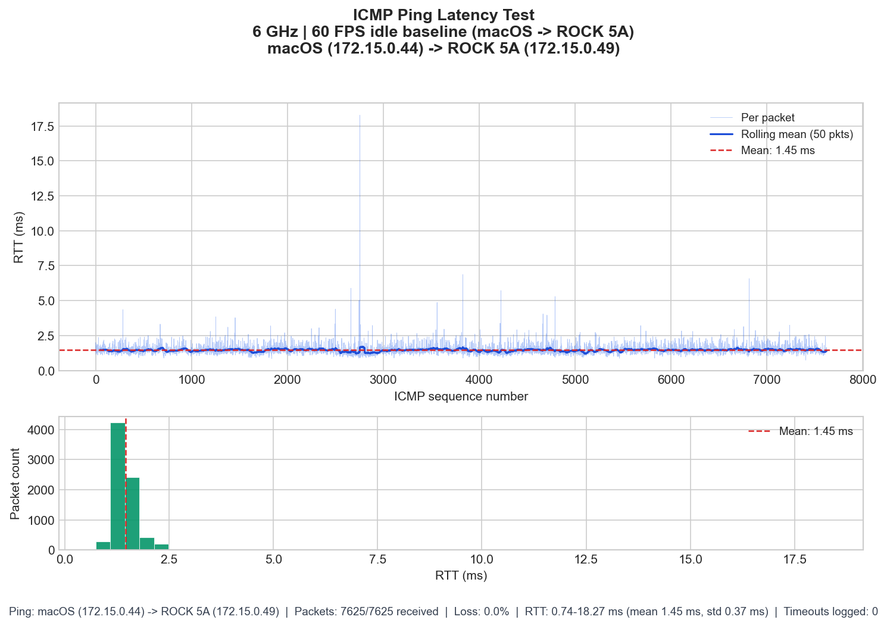
*Figure 7: 6 GHz idle round-trip latency, 60 FPS cadence, 7,625 probes (macOS → ROCK 5A, wlan0 172.15.0.49).*

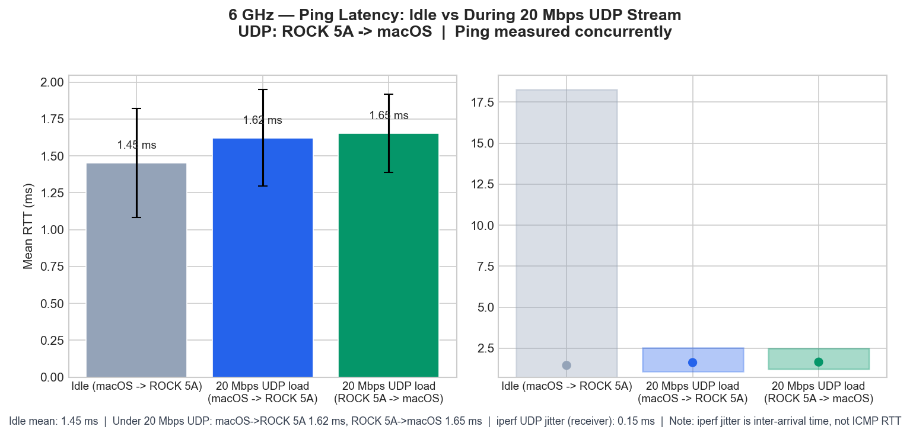
*Figure 8: 6 GHz mean RTT — idle vs. under 20 Mbps UDP load, both directions.*

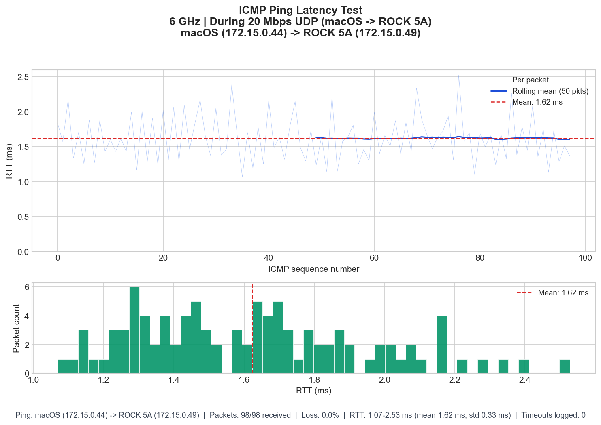
*Figure 9: 6 GHz RTT under 20 Mbps UDP load, base station → robot.*

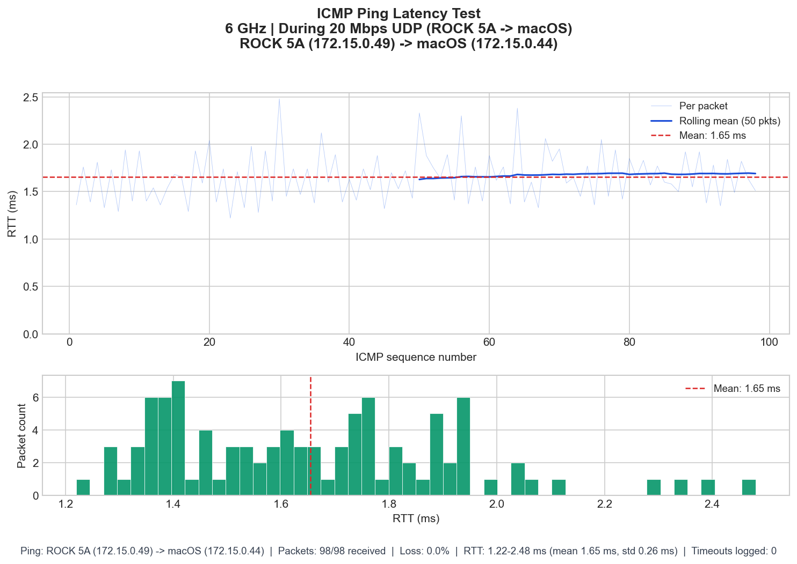
*Figure 10: 6 GHz RTT under 20 Mbps UDP load, robot → base station.*

**Analysis (6 GHz):** At 60 FPS probe rate (modelling telemetry cadence), idle RTT was **1.45 ms** (σ 0.37 ms) with zero loss over 7,625 probes. Under a 20 Mbps UDP stream, mean RTT rose only to **1.62–1.65 ms** depending on direction — comparable to or better than the earlier 5 GHz runs, with no packet loss.

### B. Throughput / Data Rate (6 GHz)

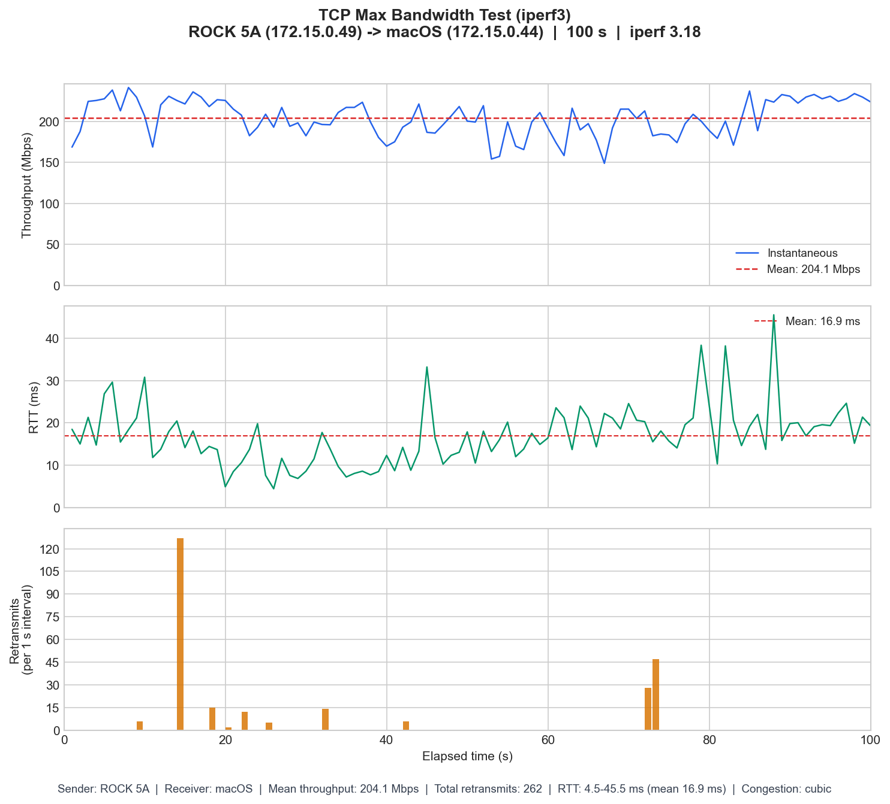
*Figure 11: 6 GHz TCP maximum-bandwidth test, robot → base station, 100 s.*

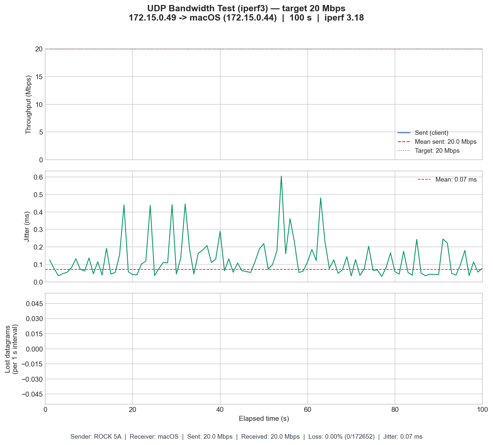
*Figure 12: 6 GHz UDP at 20 Mbps target — NPU debug-stream profile.*

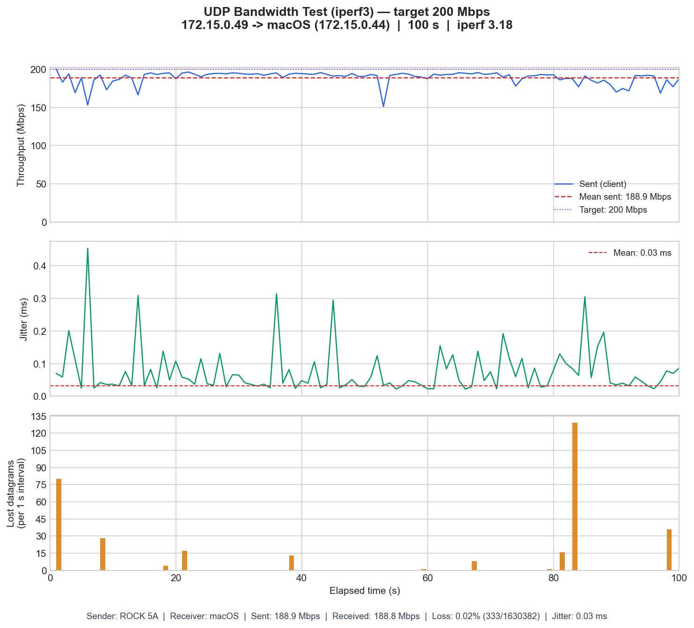
*Figure 13: 6 GHz UDP at 200 Mbps target.*

**Analysis (6 GHz):** TCP throughput reached **~204 Mbps** (receiver, **wlan0 only** — eth0 disabled to avoid same-subnet wired leakage). This is in line with the 5 GHz reference (~207 Mbps). UDP at 200 Mbps target achieved **189 Mbps** with negligible loss; at 20 Mbps the link sustained **0.00% loss**. Raw Mbps is similar across bands in this bench; the decisive 6 GHz advantage is not peak throughput but **spectrum availability and cleanliness** — see Band Selection below.

### C. Why 6 GHz (Wi-Fi 6E) over 5 GHz — Band-Selection Discussion

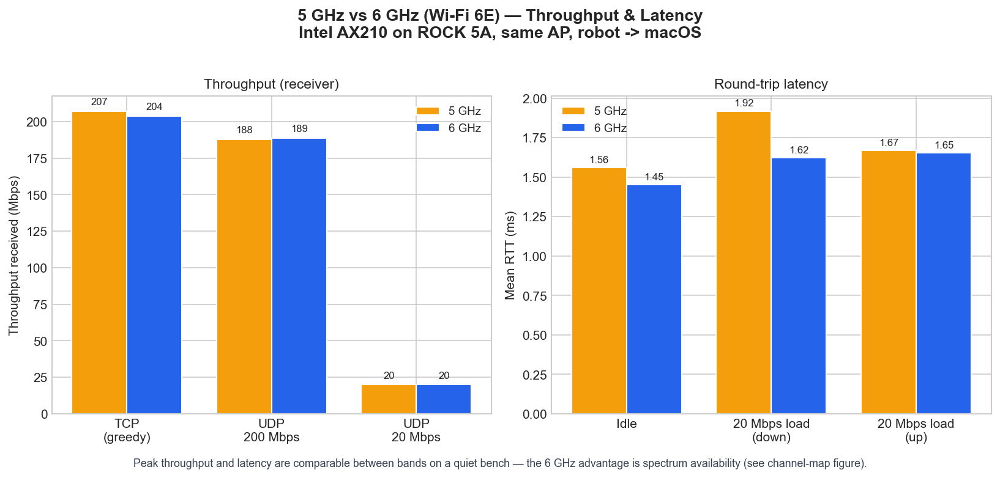
*Figure 14: 5 GHz vs 6 GHz — TCP/UDP throughput (left) and round-trip latency (right). On a quiet bench the two bands are nearly identical.*

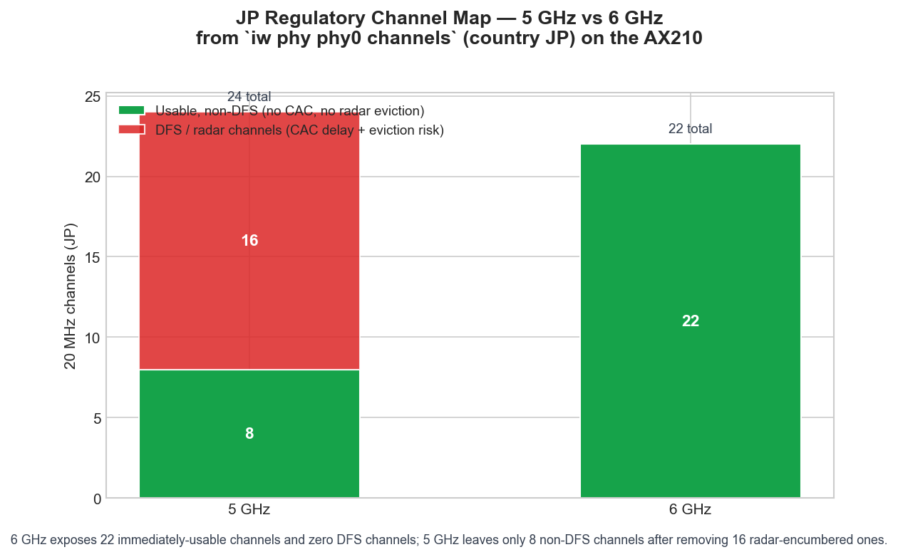
*Figure 15: JP regulatory channel map from the AX210 — 6 GHz offers 22 DFS-free channels vs only 8 non-DFS channels on 5 GHz (16 of the 24 are radar/DFS-encumbered).*

The throughput and latency numbers are similar between bands *on a quiet bench* (Figure 14), but a robot soccer venue is the opposite of quiet, and this is where the 6 GHz band of Wi-Fi 6E becomes decisive (Figure 15). Reading the AX210's actual regulatory channel map on the ROCK 5A (`iw phy phy0 channels`, country `JP`) makes the argument concrete:

| Property (JP regulatory domain) | 5 GHz | 6 GHz (Wi-Fi 6E) |
|---|---|---|
| Channels flagged for **radar detection (DFS)** | **16** channel entries (ch 52–64, 100–144) | **0** |
| Non-DFS 20 MHz channels actually usable | only **8** (UNII-1 ch 36–48 + UNII-3 ch 149–165) | **22** (and counting, as JP opens more) |
| Channel-availability check (CAC) before use | up to **60 s** on DFS channels | none |
| Radar event during a match | forces an **immediate channel switch / link drop** | cannot happen |
| Incumbent / consumer congestion | very high (every home AP, every phone) | minimal (6 GHz still sparsely deployed) |

**The DFS problem in 5 GHz.** More than half of the 5 GHz channels available to us in Japan (ch 52–64 and 100–144) are **DFS channels**: the radio must perform a Channel Availability Check (silent listening, up to ~60 s, longer on weather-radar sub-bands) *before* it may transmit, and if it ever detects a radar pulse it must **vacate the channel immediately**. For a robot during a match, a DFS-triggered channel switch means a multi-second blackout of the telemetry and control link — operationally unacceptable. In practice that leaves only the 8 non-DFS 5 GHz channels (UNII-1 / UNII-3), which are exactly the channels every consumer access point and phone hot-spot in the building is already fighting over.

**Why 6 GHz removes the constraint.** On the same module, the 6 GHz band exposes **zero radar/DFS channels** and **22 immediately-usable 20 MHz channels** in the current JP allocation — with **no CAC delay and no radar-eviction risk**. Because Wi-Fi 6E is still sparsely deployed, those channels are also far cleaner, so we can confidently run **wide (80/160 MHz) channels** for the high-resolution NPU debug stream without the channel-planning headaches of 5 GHz. In short: 5 GHz gives us *similar peak speed but a tiny, congested, DFS-encumbered pool of channels*, whereas 6 GHz gives us *the same speed plus a large pool of clean, DFS-free channels* — a far better fit for a contested, latency-sensitive RoboCup SSL environment.

### E. Latency / Throughput — 5 GHz Comparison (reference)

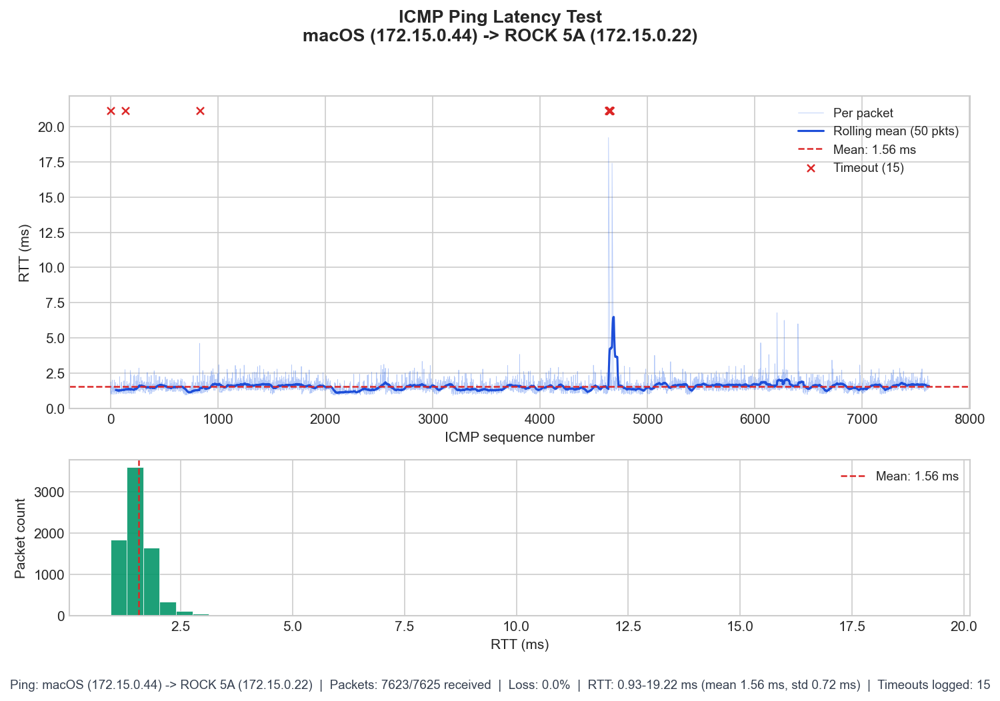
*Figure 16: 5 GHz idle latency (5180 MHz, `SSL_Rione`) — reference run.*

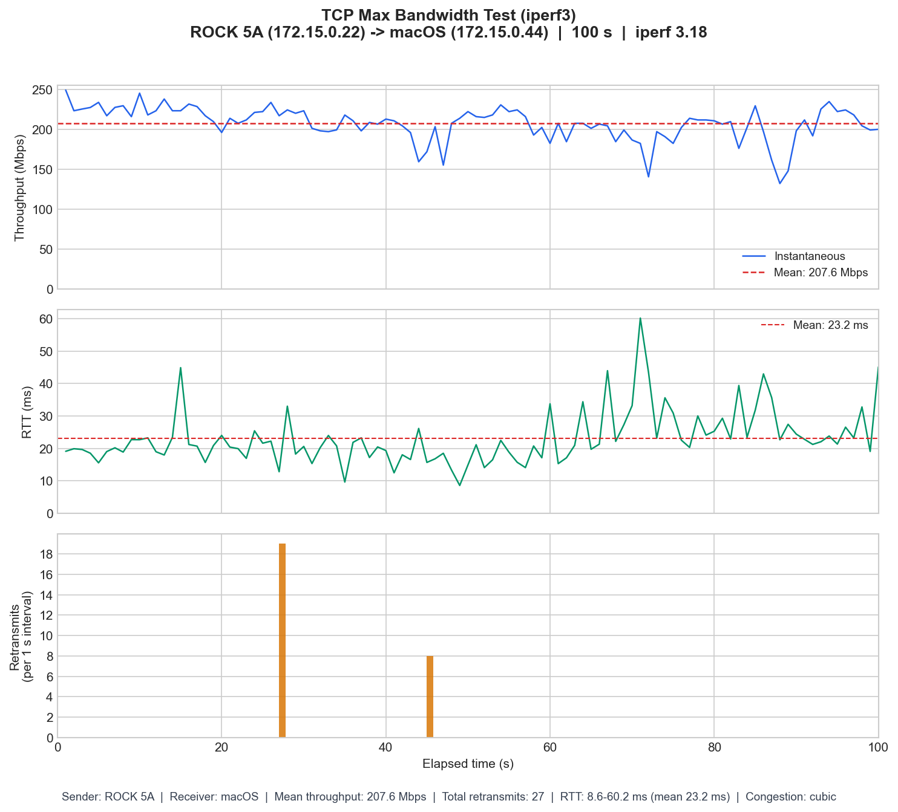
*Figure 17: 5 GHz TCP maximum-bandwidth test — reference run.*

### F. Start-Up Time and Power Consumption

**Start-up time:** `systemd-analyze blame` on the ROCK 5A attributes **7.16 s** to `ifup@wlan0.service`, which wraps Wi-Fi association (`wpa_supplicant`) and DHCP (`dhclient`). On the boot under test, `wpa_supplicant` logged `CTRL-EVENT-CONNECTED` ~4 s after `ifup` began, and `dhclient` bound address `172.15.0.22` ~7 s after `ifup` began — consistent with the systemd figure. End-to-end time until `network-online.target` was **9.35 s** from power-on, including DietPi pre-boot services that run before `ifup@wlan0` starts.

**Power consumption:** At the robot's 12 V input, current draw was **0.17 A (2.0 W)** idle and **0.26 A (3.1 W)** during the TCP max-bandwidth test — an increase of **0.09 A (~1.1 W)** under full link load. Measurements are single-point bench readings; repeated samples under idle/loaded conditions would be needed to report variance.

### G. Interference Detection and Channel Utilization

*Pending — no `iw survey dump` or HackRF spectrum capture has been logged yet. Planned setup: a HackRF One fitted with the UNIT-C6L's antenna to visualize channel congestion, with a figure showing channel busy time vs. packet loss once collected.*

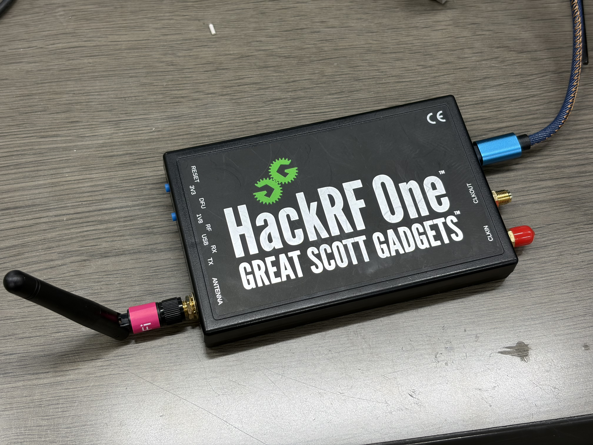
*Figure 18: HackRF One SDR, to be used for the planned spectrum capture.*

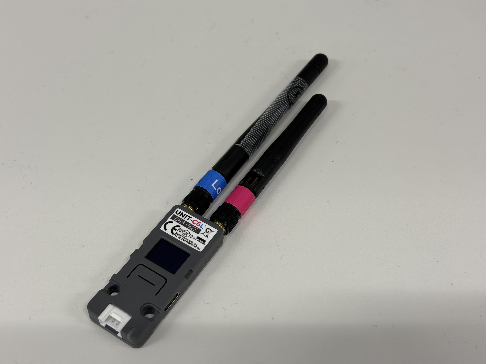
*Figure 19: UNIT-C6L, whose antenna will be paired with the HackRF One for channel-congestion visualization.*

## 7. Conclusion

Our approach shows that COTS Wi-Fi 6E modules like the Intel AX210 can provide a highly accessible, low-cost, and robust communication link for SSL robots. Paired with the ROCK 5A, it clears the bandwidth bottleneck for Edge-AI applications while avoiding the congested 2.4/5 GHz spectrum entirely. We encourage other teams to consider this architecture as a way to reduce hardware-development overhead — directly in line with the Technical Challenge's goal of lowering the barrier to entry for new and existing teams.

## 8. Open Items — Still Needed Before Final Submission

- **Confirm band/channel:** ~~needed~~ — **done** for 6 GHz (`5975 MHz`, `SSL_Rione_6G`; see [MEASUREMENT.md](MEASUREMENT.md) Section 10).
- **Identify the access point/router** used to bridge the ROCK 5A and the base station for these bench tests, for the methodology writeup.
- **Detect Interference:** run an `iw dev wlan0 survey dump` capture and/or a HackRF One + UNIT-C6L antenna spectrum scan, correlated with packet loss. (Setup planned, capture not yet run — image to be added once captured.)
- **Power consumption (variance):** repeat idle/loaded current readings to report σ; current table entries are single bench samples.
- **Network-switching demonstration:** the official rules require demonstrating quick switching between the TC-provided shared Wi-Fi network and the team's own network during a short friendly match — not yet tested (see the switching procedure discussed earlier in this conversation).
- **eCAD/STL files:** the draft references STL files for antenna mounts; these aren't in the repo yet and are required for the open-source release.
- **Repository URL:** the setup instructions in Section 3 still use a placeholder `<your-repo>` — replace with the final repo name/link before submitting to the mailing list.
